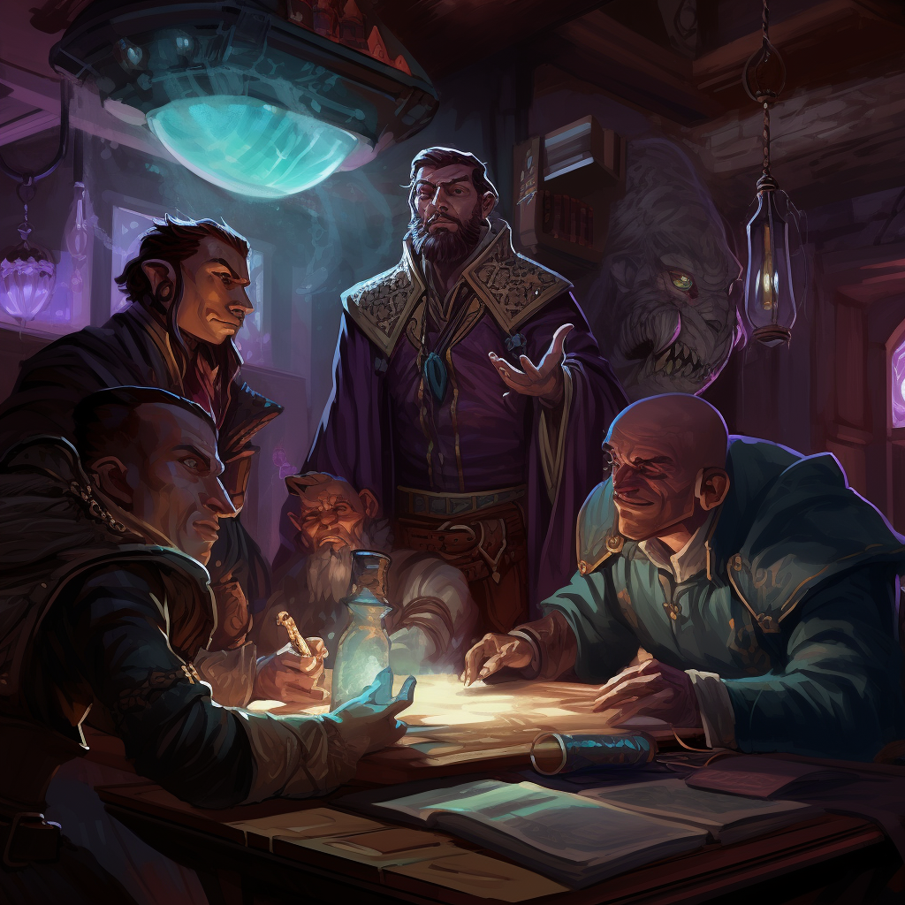

<h1><i>ibook sub</i> <u>ai</u></h1>

Subalias to subscribe to the spells within Acquisition's Incorporated

## Help:
`!ibook sub ai`: Subscribes to Acquisition's Incorporated

## Licensing:
This subalias requires owning the spells from [Acquisition's Incorporated](https://www.dndbeyond.com/sources/ai):
- Distort Value
- Fast Friends
- Gift of Gab
- Motivational Speech
- Incite Greed
- Jim's Glowing Coin
- Jim's Magic Missile

## JSONs:
Don't bother trying to manually put these spells in if you do not have access to them as Avrae will not let you cast the spell without having access to them.

- [Expanded](https://raw.githubusercontent.com/SethHartman13/Magic-Book-Library/main/Code/Aliases/ibook/sub/ai/jsons/acquisitions_incorporated.json)
- [Condensed](https://raw.githubusercontent.com/SethHartman13/Magic-Book-Library/main/Code/Aliases/ibook/sub/ai/jsons/ai.json)