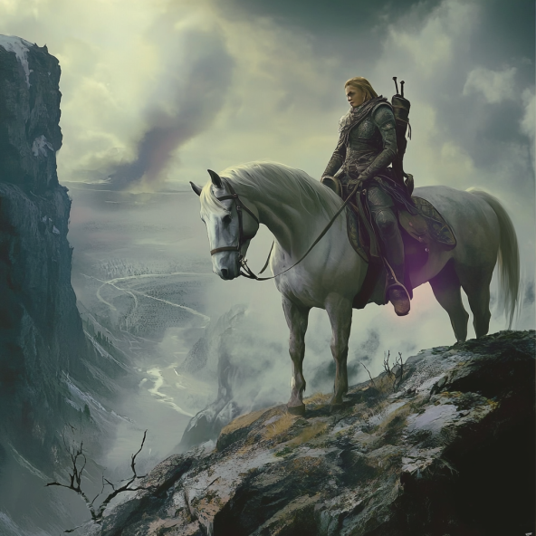

<h1><i>ibook sub</i> <u>boet</u></h1>

Subalias to subscribe to the spells within Book of Ebon Tide

## Help:
`!ibook sub boet`: Subscribes to the Book of Ebon Tide

## Licensing:
This subalias requires owning the spells from the [Book of Ebon Tide](https://www.dndbeyond.com/sources/boet):
- Bitter Wind
- Blade of Blood and Bone
- Bright Sparks
- Burning Radiance
- Charnel Banquet
- Child of Light and Dark
- Cloak of Shadow
- Conjure Ferryman
- Conjure Giant
- Darkbolt
- Deep Roots of the Moon
- Doom of False Friends
- Doom of Poor Fortune
- Doom of Stacked Stones
- Doom of Summer Years
- Douse Light
- Drayfn's Bane of Excellence
- Drayfn's Blunted Blade
- Drayfn's Curse of Incompetence
- Drizzle
- Ebon Tide
- Elf Shot
- Emerald Goblet
- Faerie Toast
- Feast of Flesh
- Fire Dance
- Fireflies
- Flowering
- Gloaming
- Grim Harvest
- Grim Shadows
- Hero of Fable
- Hibernation
- Knife of Fate
- Krail's Maggot
- Krail's Rot
- Krail's Rupture
- Leiloch's Arduous Shuffle
- Leiloch's Interminable Yarn
- Leiloch Irritating Kazoo
- Life Drain
- Living Shadows
- Lost
- Lost and Wandering
- Lunar Transfer
- Maddening Whispers
- Moonlight Sending
- Obfuscate Object
- Ominous Winds
- Orros Mark of Fate
- Polychromatic Bubble
- Portho's Portal
- Pratfall
- Radiant Beacon
- Searing Sun
- Shadow Adaptation
- Shadow Gateway
- Shadow Portal
- Shadow Step
- Slither
- Spider Song
- Storm Door
- Ugly Duckling
- Void Strike
- Word of Misfortune

## JSONs:
Don't bother trying to manually put these spells in if you do not have access to them as Avrae will not let you cast the spell without having access to them.

- [Expanded](https://raw.githubusercontent.com/SethHartman13/Magic-Book-Library/main/Code/Aliases/ibook/sub/boet/jsons/book_of_ebon_tide.json)
- [Condensed](https://raw.githubusercontent.com/SethHartman13/Magic-Book-Library/main/Code/Aliases/ibook/sub/boet/jsons/boet.json)