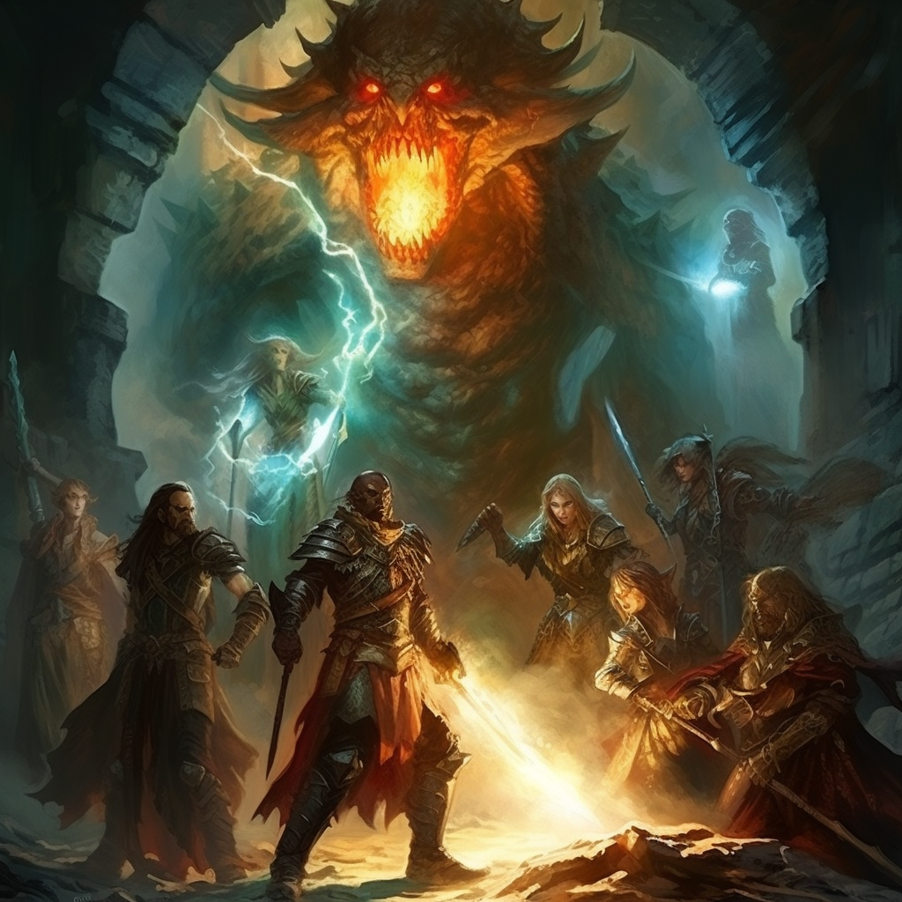

<h1><i>ibook sub</i> <u>scag</u></h1>

Subalias to subscribe to the spells within the Sword Coast's Adventurer's Guide

## Help:
`!ibook sub scag`: Subscribes to the Sword Coast's Adventurer's Guide

## Licensing:
This subalias requires owning the spells from the [Sword Coast's Adventurer's Guide](https://www.dndbeyond.com/sources/scag):
- Booming Blade
- Green-Flame Blade
- Lightning Lure
- Sword Burst

## JSONs:
Don't bother trying to manually put these spells in if you do not have access to them as Avrae will not let you cast the spell without having access to them.

- [Expanded](https://raw.githubusercontent.com/SethHartman13/Magic-Book-Library/main/Code/Aliases/ibook/sub/scag/jsons/sword_coast_adventurers_guide.json)
- [Condensed](https://raw.githubusercontent.com/SethHartman13/Magic-Book-Library/main/Code/Aliases/ibook/sub/scag/jsons/scag.json)