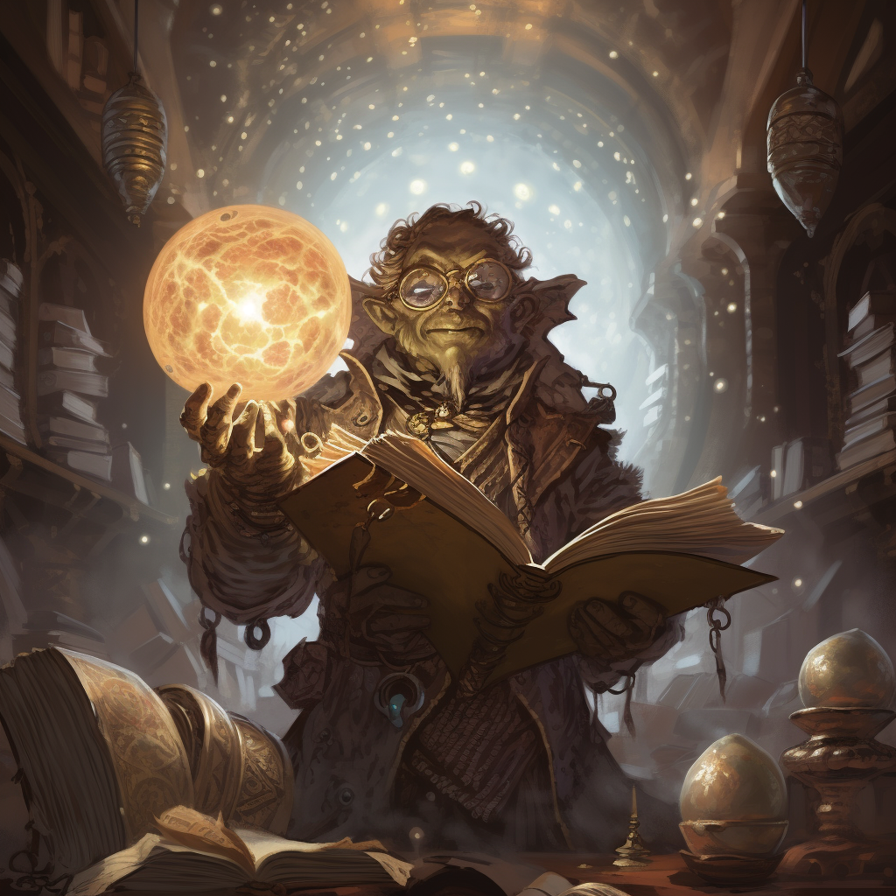

<h1><i>ibook sub</i> <u>xgte</u></h1>

Subalias to subscribe to the spells within Xanthar's Guide to Everything

## Help:
`!ibook sub xgte`: Subscribes to Xanthar's Guide to Everything

## Licensing:
This subalias requires owning the spells from [Xanthar's Guide to Everything](https://www.dndbeyond.com/sources/xgte):
- Summon Greater Demon
- Summon Lesser Demons

## JSONs:
Don't bother trying to manually put these spells in if you do not have access to them as Avrae will not let you cast the spell without having access to them.

- [Expanded](https://raw.githubusercontent.com/SethHartman13/Magic-Book-Library/main/Code/Aliases/ibook/sub/xgte/jsons/xanthars_guide_to_everything.json)
- [Condensed](https://raw.githubusercontent.com/SethHartman13/Magic-Book-Library/main/Code/Aliases/ibook/sub/xgte/jsons/xgte.json)